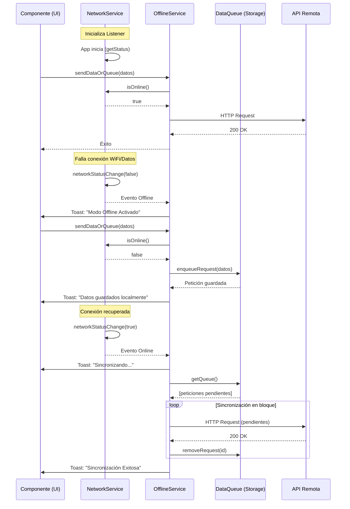

# Diagrama de Flujo del Detector de Red y Modo Offline

A continuación se muestra el diagrama Mermaid que explica cómo la aplicación detecta la pérdida de red, almacena la información localmente, y sincroniza una vez que vuelve el internet.

